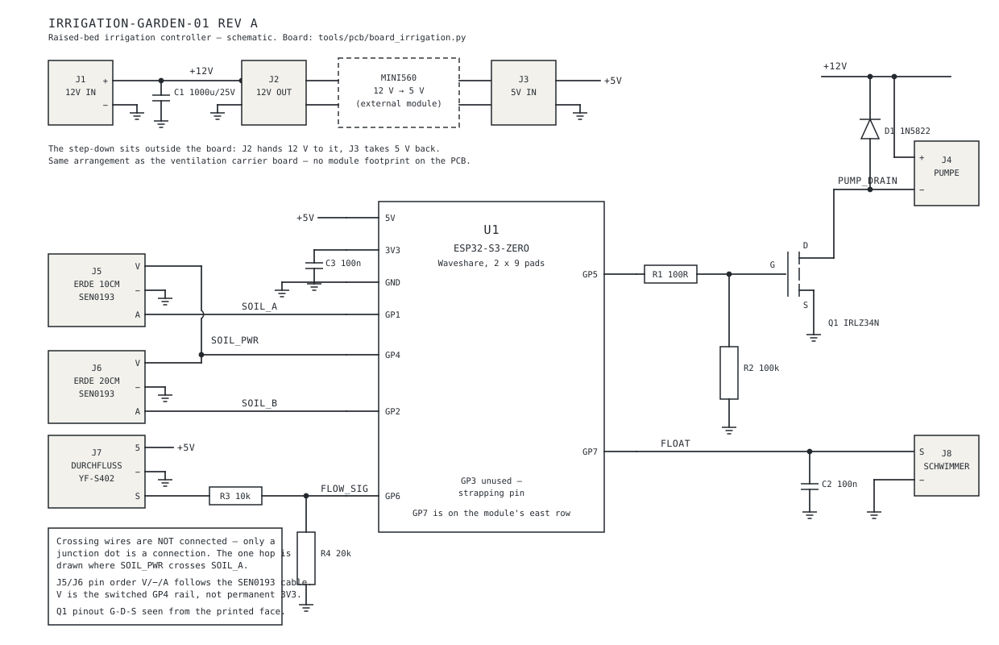

# Raised-bed irrigation, garden

Design document for `irrigation-garden-01` — a self-contained ESPHome
controller that keeps a 1 m² strawberry bed evenly moist from a manually
refilled 20 l canister.

Status: **design, not built.** Every number below is a starting value, to be
replaced by a measured one after the calibration week (see
[Commissioning](#commissioning)).

## The problem

The bed is planting soil over a clay-pebble drainage layer, wrapped in a
rigid dimpled membrane that deliberately lets water escape at the sides.
That construction cannot be watered like a pot. It has two properties that
decide the whole design:

**The infiltration rate is the limit, not the volume.** Soil takes up water
at a finite rate. Deliver 4 l in one go and most of it runs sideways
through the membrane and downwards through the pebbles before the substrate
can absorb it. The plants see a fraction of what was pumped, and the sensor
sees a spike that decays within the hour.

**Water that reaches the drainage layer is lost.** There is no reservoir
underneath — the pebbles drain. Anything measured at the bottom of the root
zone is water on its way out.

Both point to the same answer: **short pulses with a swelling pause**,
dosed by time, verified by two sensors at different depths.

Strawberries add one constraint of their own: fruit and leaves must stay
dry. Botrytis (grey mould) needs leaf wetness to establish, and a wet berry
in warm air is the textbook case. Water goes onto the soil at root level,
never over the plant, and in the early morning so that any splash dries
within the hour.

## Control logic

Pump one pulse when **all** of these hold:

1. shallow soil moisture below the on-threshold (hysteresis to the off-threshold)
2. canister float switch not in the empty position
3. outdoor temperature > 3 °C
4. inside the time window (05:00–08:00, optional second window 19:00–20:00)
5. at least 20 min since the end of the last pulse
6. daily pulse budget not exhausted
7. no leak reported by the shed water sensor
8. both soil sensors valid and reading a physically possible value

A pulse is **1.0 litre, measured**, with 30 s of pump time as the backstop —
whichever ends first. Then 20 min of nothing, then measure again. If the
shallow sensor is still below the threshold, pulse again — up to the daily
budget.

Dosing by volume rather than by time is what the flow sensor buys. Pump
delivery is not a constant: it falls as the canister empties and the
suction head grows, it falls again when the filter starts to load, and it
depends on how the six outlet tubes happen to lie. A timed pulse silently
delivers less water every day the filter ages. A metered pulse delivers a
litre or reports that it could not.

### The deep sensor is the runoff detector

The two soil sensors are not redundancy. The shallow one (10 cm) sits in
the root zone and drives the decision. The deep one (20 cm, just above the
pebbles) answers a different question: *did this pulse stay where it was
wanted?*

A pulse that raises the shallow reading and leaves the deep one flat was
absorbed. A pulse that moves the deep sensor sharply within a few minutes
went past the roots into the drainage. That is a reason to shorten the
pulse, not to add another one — so a sharp deep-sensor rise suppresses the
next pulse and is worth an alert. It is also the cheapest way to notice
that the substrate has gone hydrophobic after a dry spell, which shows up
as *both* sensors moving at once.

### Dosing arithmetic

| | |
| --- | --- |
| Bed area | ~1 m² |
| Peak demand, hot summer day | 3–6 l/day, i.e. 3–6 mm |
| Pump delivery, free flow (data sheet) | 4.3 l/min |
| Pulse | 1.0 l ≈ 1 mm, about 15 s |
| Time backstop per pulse | 30 s |
| Daily budget | 6 pulses = 6 l |
| Canister endurance at full budget | ~3.3 days |

Six pulses at the budget limit is the worst case, not the expectation. A
20 l canister will realistically last four to six days. If that rhythm
turns out to be annoying, the same hardware drives a 60–100 l barrel
unchanged — only the level sensing changes.

## Where it runs

On the ESP, not in Home Assistant. Same reasoning as the cellar ventilation
([cellar-ventilation.md](cellar-ventilation.md#where-it-runs)): a controller
that keeps acting on frozen data is worse than one that stops. Here the
failure is more expensive than a fan running at the wrong time — a pump that
is commanded on and never commanded off empties the canister into the shed.

Home Assistant supplies two values and receives everything else:

| Direction | What |
| --- | --- |
| HA → device | outdoor temperature (frost lockout), leak-sensor state (hard block) |
| device → HA | both soil readings, pulse counter, litres consumed, canister state, all thresholds as `number` entities |

Both imported values go stale after 15 min. A stale value disables the
check it feeds — no frost lockout without a fresh temperature, no leak
block without a fresh leak state — but it does not stop watering. The
protections that matter against a flooded shed are all local: the per-pulse
volume, the 30 s cap, the daily budget and the flow plausibility check that
catches a burst hose faster than a floor sensor can. The Home Assistant
leak sensor is the backstop behind those, and a backstop that is only as
good as the Wi-Fi link is still worth having.

If Wi-Fi is gone entirely, the device therefore keeps watering on soil
moisture alone within its time window and budget. That is deliberate — the
soil sensors, the budget and the maximum runtime are all local. A week
without Home Assistant should not kill the strawberries.

## Hardware

| Part | Choice |
| --- | --- |
| Controller | ESP32-S3-Zero, the module the ventilation controllers use |
| Pump | Seaflo 12 V self-priming diaphragm pump, 4.3 l/min, 2.4 bar |
| Soil moisture | 2 × DFRobot SEN0193 capacitive probe |
| Flow | Seeed YF-S402 Hall flow sensor, 0.36–6 l/min |
| Level | reed float switch, side mount |
| Switching | IRLZ34N logic-level MOSFET + 1N5822 Schottky flyback diode |
| Supply | 12 V / 5 A PSU + MINI560 step-down for the ESP |
| Enclosure | IP65 box, M16 cable glands |
| Water path | suction strainer, check valve, inline filter, 4/6 mm tube, six-way manifold |

Prices and availability: [Bill of materials](#bill-of-materials).

### Why the S3-Zero and not the ESP32 D1 Mini

The first draft of this document specified the ESP32 D1 Mini, on the grounds
that `temp-sensor-wall-01` already runs one. The carrier board changed that.

A PCB needs a footprint, and a footprint needs verified dimensions. The
S3-Zero footprint has been built twice and measured once — it is in
[`tools/pcb/board_cellar_fan.py`](../../tools/pcb/board_cellar_fan.py),
whose header records exactly which dimension was an assumption and why.
Deriving a new footprint from a data sheet for a module nobody in this
house has put a caliper on is how a board comes back from the fab
unusable. The module also happens to cost less, is stocked, and means the
irrigation controller and the two ventilation controllers share a spare.

The cost is one pin. GP3 is a strapping pin and stays unused, which leaves
five usable pads on the module's left row for six signals. The float
switch — a slow digital input, the least sensitive of the six — moves to
GP7 on the right row.

### Why a diaphragm pump and not a submersible

The diaphragm pump sits **dry** in the shed and sucks from the canister.
The characteristic failure of a submersible pump in a manually refilled
canister is running dry, and that destroys it in minutes. A diaphragm pump
tolerates the seconds it takes the controller to notice there is no flow.
1.5 m of head is 0.15 bar — the pump is not working hard.

### Why open outlets and not drippers

Pressure-compensating drippers need roughly 0.7–1 bar to regulate. Six
2 l/h drippers pass 12 l/h; the pump delivers 4.3 l/min, about 260 l/h.
The pump would spend the cycle short-cycling on its pressure switch to
feed a trickle, and every dripper is a clogging point fed from a canister
that will grow algae.

Six open 1/4" outlets on **equal-length** tubes from one manifold pass the
pump's full flow, dose by time instead of by pressure, and have nothing to
clog. Equal lengths matter — unequal ones give unequal flow, and on 1 m²
that is visible as a dry corner. Spread them on roughly a 30 cm grid;
lateral spread in this substrate is 15–20 cm radius, so six points cover
the bed.

The inline filter stays regardless. It protects the pump, not the outlets.

### Power

The shed has no socket of its own. The supply is the AC-out socket of the
Anker Solarbank 3 E2700 standing in it — a real backup output that powers a
load, and one that does not switch itself off below a minimum load. That
second property is what made this worth checking: such outputs commonly
drop out under a few watts, an ESP idles at about one, and the resulting
reboot loop looks like a Wi-Fi fault for a week before anyone measures it.
It is not an issue here, so the 12 V PSU hangs directly on that socket with
no buffer battery.

What remains true is that the socket follows the Solarbank. If the unit is
switched off, taken away for the winter or runs its battery flat, the
controller is dead — not degraded. That is acceptable for irrigation and it
fails in the safe direction (a dead controller cannot pump), but it means
the *absence* of watering has no local alarm. Home Assistant notices the
device going unavailable; that is the alarm.

Everything downstream of the PSU is 12 V SELV. No mains enters the wooden
shed except inside the IP65 enclosure.

### The enclosure

Four things go in the box, and the one rule is that **nothing that
carries water does**.

| Inside | Why there |
| --- | --- |
| Carrier board, on four M3 standoffs | the reason the box exists |
| Mean Well LPV-60-12 (163 × 43 × 32 mm) | its mains leads are fixed tails and have to be joined to the incoming lead somewhere dry — this is the only dry place |
| MINI560 step-down | a few centimetres of wire from J2 and to J3; stick it down with foam tape so it cannot wander |
| Lever terminals for L, N and PE | the mains junction between the incoming lead and the PSU tails |

| Outside, cable through a gland | Gland |
| --- | --- |
| mains lead from the Solarbank socket | M16 |
| pump lead | M16 |
| two soil probes, flow sensor, float switch | 4 × M12 |

Pump, flow sensor, filter, check valve and hoses all stay **outside**. An
IP65 box keeps water out and, just as reliably, keeps it in: a weeping
fitting inside it turns the enclosure into a sealed bathtub around a mains
supply. The flow sensor sits in the water line; only its cable comes in.

**Fit.** The box is 200 × 150 × 100 mm outside. The PSU lies along one long
wall and the 80 × 70 mm board beside it — 43 + 70 = 113 mm across the
150 mm width, which leaves room for the lever terminals and the cable
runs. Height is not a constraint.

**Mount without breaching the seal.** Every screw through the floor is a
hole in an IP65 box. Glue the standoffs in with the same epoxy as the soil
probes, or use the enclosure's internal bosses if it has any.

**Cables enter from below.** Mount the box with the glands on its lower
face and let each cable hang in a loop below its gland, so that water
running down a cable drips off the bottom of the loop instead of being led
to the seal. Mains and pump glands at the PSU end, the four signal glands
at the board end — that keeps mains and sensor cables apart inside.

**Mains inside the box — three rules.**

- Keep the mains side at the PSU's end and tie the incoming lead down, so
  that no mains conductor can reach the board even if a terminal lets go.
  The PSU's own case is the barrier between the two sides.
- If the PSU has only two input wires (L, N), the green-yellow conductor of
  the incoming three-core lead still gets its own lever terminal. Never cut
  it short and leave it loose.
- Mains outdoors belongs behind an RCD. Check whether the Solarbank's
  AC-out socket provides residual-current protection; if it does not, a
  portable RCD in front of the plug.

**Condensation.** The box crosses its dew point every night. A sealed
enclosure breathes regardless — temperature pumps air in and out through
the gland seals — and the moisture it draws in condenses on the coldest
surface inside it. A **pressure-compensation vent** equalises the pressure
through a membrane that passes air but not liquid water. An M12 vent fits
the same hole size as the four signal glands; put it in a side wall, not
in the lid. The first draft of this document listed one, and it fell out
of the bill of materials when the rest was pinned to articles.

**Antenna.** Point the module's USB-far end — the antenna — away from the
PSU and away from the Solarbank. A battery that size is a lot of material
between the antenna and the access point. The ABS wall itself barely
attenuates 2.4 GHz; it is not the problem.

### Pin plan

ESP32-S3-Zero. **ADC2 is unusable while Wi-Fi is on** — both soil sensors
must land on ADC1, which on the S3 is GPIO1–GPIO10.

| Pin | Row | Function | Note |
| --- | --- | --- | --- |
| GP1 (ADC1_CH0) | left | soil sensor A, 10 cm | |
| GP2 (ADC1_CH1) | left | soil sensor B, 20 cm | |
| GP3 | left | **unused** | strapping pin, JTAG source select |
| GP4 | left | sensor supply, high side | both sensors ~10 mA total, within the 40 mA pin limit |
| GP5 | left | pump MOSFET gate | 100 Ω series, 100 kΩ gate-to-source pulldown |
| GP6 | left | flow sensor pulse | 10k/20k divider from the 5 V sensor output |
| GP7 (ADC1_CH6) | right | float switch | internal pull-up, switch to GND, closed while water is present, 100 nF debounce |

GP7 is the pin furthest from the USB connector on the right row, so its
track leaves past the end of the module rather than crossing the other
row. GPIO0, GPIO19/20 (USB) and GPIO21 (onboard RGB LED) are unavailable
on this module for the reasons listed in
[esphome.md](../esphome.md#board-specific-notes).

### Why the flow sensor gets a divider and not a pull-up

The YF-S402 runs on 5 V, and batches differ in whether the Hall output is
driven to 5 V or open drain with an on-board pull-up to 5 V. A 10k/20k
divider produces a valid 3.3 V high level in both cases; a pull-up to 3V3
would work for one of them and put 5 V on the pin for the other. The one
case the divider does not cover is an open-drain output with no pull-up at
all — that shows up in week 2 as a sensor that never counts, and is fixed
with a pull-up to 5 V ahead of the divider.

Static IP: 192.168.2.52 — verify it is free before flashing; .41–.48, .50
and .51 are taken.

### Powering the soil sensors from a GPIO

The sensors are energised only for the ~200 ms of a measurement, then
switched off. Capacitive probes corrode where the electronics meet the
soil, and continuous excitation accelerates it; duty-cycling the supply
buys a season or two. It also removes the self-heating drift that makes a
continuously powered probe read differently at 07:00 and at 15:00.

Switching must be **high side**. Interrupting the sensor's ground moves the
analog reference and the reading becomes meaningless.

### Sealing the soil probes

Both probes end up fully buried, so the whole electronics head needs
sealing, not only the cable entry. Buried, unsealed capacitive probes
survive about one season, and the SEN0193 has three weak points — sealing
only one of them is the usual way it fails anyway:

1. **The electronics head** — timer, regulator and passives, bare at the
   top of the board.
2. **The JST connector** — not waterproof, and a mechanical contact in wet
   soil.
3. **The cut board edges.** The solder mask covers both faces of the probe
   but not its milled FR4 edges. Water wicks into the laminate from there
   and changes the dielectric the measurement depends on. It shows up as
   slow drift rather than as a failure, which makes it the hardest of the
   three to notice.

Procedure, identical for both probes:

1. Desolder the JST connector and solder a **round-jacketed** 3-core cable
   straight to the pads. A seal can grip a round jacket; it cannot grip
   three loose wires.
2. Strip the jacket about 10 mm back *inside* what will be potted, so the
   compound seals against the jacket **and** each insulated core. Water
   otherwise creeps along the strands inside the insulation by capillary
   action, straight past a seal that only grips the outside.
3. Coat the cut edges along the full length of the probe with a thin film
   of epoxy or acrylic protective lacquer. **Edges only**: the sensing
   faces are already masked, and every extra layer on them adds dielectric
   and costs sensitivity.
4. Pot the head in a small mould — a piece of tube, a cut glove finger, a
   3D-printed cup — with slow-cure two-component epoxy, down to the white
   marker line and no further. Epoxy rather than potting silicone: a
   silicone gel fills but barely adheres to FR4 or to the cable jacket, and
   in soil, with no enclosure around it, that interface is exactly where
   water creeps in. Epoxy bonds, and it doubles as the edge coating in
   step 3.

   The compound in the BOM mixes **2:1 by weight**, and a wrong ratio
   leaves it tacky for good. Two heads need about 10 g, of which the
   hardener is barely 3 g — below what a kitchen scale weighs reliably.
   Mix a 30 g batch instead (20 g + 10 g), use the rest on the edges, and
   leave a blob in the mixing cup as a witness: if that has not gone hard
   after 12 h, neither have the sensors.
5. Optionally, adhesive-lined 3:1 heat-shrink over the transition from
   potting to cable as strain relief. Plain heat-shrink on its own is not a
   seal outdoors.

**Never acetic-cure silicone** — ordinary bathroom silicone. It smells of
vinegar while it cures because it releases acetic acid, and that acid
attacks copper and solder inside the very seal meant to protect them.
Neutral-cure (oxime or alkoxy) or proper potting compound only.

### Installing the soil probes

**Horizontal, on edge — not vertical.** A vertical probe averages over its
roughly 6 cm sensing length, so "at 20 cm" really means somewhere between
14 and 20 cm. Laid horizontally at the target depth it reads a defined
layer, which is the whole point of the deep probe as a runoff detector.
On edge, broad faces vertical, so water does not pool on the upper face.

Dig to depth, push the probe sideways into the undisturbed side wall, then
backfill and firm gently. Air gaps around a capacitive probe distort the
reading more than anything else. Keep 2–3 cm of soil between the deep
probe and the clay pebbles: a probe touching the drainage layer measures
the pebbles, not the root zone.

**Both probes identically** — same sealing, same orientation, only the
depth differs. The control logic compares the two readings with each other,
and two probes that see different volumes of soil make that comparison
meaningless.

## Schematic



Source: [`garden-irrigation-schematic.svg`](garden-irrigation-schematic.svg).
Crossing wires are not connected — only a junction dot is a connection.

Four things in it are worth reading twice:

**The pump is switched low side.** Its positive lead goes straight to
+12 V, its negative lead to Q1's drain. Wired the other way round — MOSFET
in the positive lead — the gate would have to sit above 12 V to turn the
device on, and a 3.3 V pin cannot do that. This is the single most common
way to get a MOSFET switch wrong.

**D1 points up.** Cathode to +12 V, anode to the drain. Fitted the other
way round it is a short across the supply from the moment power is
applied, and a 5 A PSU wins that argument before anyone smells anything.

**J5/J6 pin V is not 3V3.** It is GP4, the switched sensor rail. Wiring a
probe to permanent 3V3 works perfectly and quietly destroys the duty
cycling that keeps the probe alive past one season.

**R2 is not a detail.** It holds Q1's gate low during the ~300 ms between
power-on and ESPHome configuring GP5. Until then the pin is an input and
the gate floats — and a floating logic-level gate next to a 12 V rail is
enough to turn the MOSFET partly on, which means a warm MOSFET and a
pump that hums at every reboot.

## Carrier board

Generated by the existing chain in [`tools/pcb/`](../../tools/pcb), which
now holds two boards:

| File | Board |
| --- | --- |
| [`board_cellar_fan.py`](../../tools/pcb/board_cellar_fan.py) | ventilation controller, built, `rev B` |
| [`board_irrigation.py`](../../tools/pcb/board_irrigation.py) | this one, `rev A`, not yet ordered |

[`board.py`](../../tools/pcb/board.py) became a selector, so the six tools
that all do `import board as B` did not have to change:

```bash
cd tools/pcb
export PCB_BOARD=board_irrigation
python preview.py
python verify.py
python gerber.py
python check_gerber.py
python export_bom.py
```

The default stays the cellar fan: a mistyped variable must not silently
regenerate manufacturing data for the board that is already in service.

Current state — 80 × 70 mm, 18 components, 56 pads, 60 drills:

```
Geometry check passed without findings.
Copper: 21 track segments, 56 pads, 0 Via(s)
  Clearance:   all >= 0.25 mm
  Continuity:  each net is fully connected
  Short:       none
  Packages:    pin order, polarity and lead fit as declared
  Ground:      one island, 5139 mm2, all GND pads connected
GERBER PLAUSIBLE
```

### Pre-fabrication review

The board was re-read against the data sheets before ordering, because
the ventilation board's revision A shipped with Q1's gate and drain
swapped and that is a 40 € mistake to repeat. What the review found:

| Finding | Status |
| --- | --- |
| Q1 pin order G-D-S, tab = drain | **correct**, confirmed against the Infineon/Vishay IRLZ34 data sheet |
| Q1 net assignment (gate to GP5, drain to the pump, source to GND) | **correct** |
| D1 orientation, cathode to +12 V | **correct** |
| `D1` drill 1.2 mm | **wrong** — the DO-201AD lead is 1.20–1.30 mm, so the hole was narrower than the part. Now 1.5 mm |
| `D1` pitch 10.16 mm | **wrong** — a 9.50 mm body left 0.33 mm per side to bend a 1.3 mm lead. Now 15.24 mm |
| `Q1` keepout 8.5 mm wide | **wrong** — a TO-220 body is 10 mm. Now 10.7 mm |
| `C1` polarity marker | **wrong** — the "+" sat inside the can outline and would have been hidden by the capacitor. Moved outside |
| Silkscreen label overlaps | four found, all fixed |

None of these were visible in the netlist, and none of them are
electrical. They are mechanical facts from data sheets that nothing in
the chain had been comparing against the geometry — which is exactly the
shape of the original Q1 mistake. All five are now checked by
[`pinout.py`](../../tools/pcb/pinout.py); see
[tooling.md](../tooling.md#pin-order-as-data).

Two things the review did **not** resolve:

**The module footprint is still an inherited assumption.** 18.00 × 23.50 mm
with 15.24 mm row spacing, taken from the ventilation board. Measure the
Waveshare module before sending the Gerbers.

**The ceramic antenna is now unobstructed on this board, but untested.**
Waveshare asks for PCB, metal and plastic to be kept clear of the antenna
area, and the module is soldered flat, so its antenna sits directly on
this board. `COPPER_KEEPOUT` cuts a 12,8 × 4,6 mm opening in the ground
plane underneath it — the ground pour drops from 5139 to 5078 mm² and
stays a single island. The opening lies in the corridor between the two
pad rows and cost neither a pad nor a track.

That is insurance, not a measurement. Nobody has quantified the loss on
the ventilation boards, which work indoors near the AP. Check the Wi-Fi
signal sensor once the board is in its IP65 box and before the box goes
into the shed — this device sits further from the AP than any of the
others.

### What differs from the ventilation board

The module footprint is identical — that reuse is the whole reason for the
S3-Zero. Everything around it changed:

- **Trace width.** +12V, GND and PUMP_DRAIN are 1.5 mm, not 1.0. The
  Seaflo draws around 4 A at its pressure limit and more for the first
  milliseconds; 1.0 mm was sized for a 0.2 A case fan and would run warm
  here.
- **C1 is 1000 µF, not 100.** A diaphragm pump starts against a stalled
  rotor. Without the buffer, that dip reaches the MINI560 input and
  reboots the ESP — a failure that looks exactly like a Wi-Fi problem for
  as long as you are willing to believe it is one.
- **No solder jumper, no tach filter.** Q1 is switched on and off, never
  PWM'd, so the whole JP1/C2 complex of the other board disappears.
- **Connectors on three edges.** Eight cables leave this board: 12 V in,
  12 V out and 5 V in for the MINI560, pump, two soil probes, flow and
  float. The component field is what is left in the middle, and J8 sits
  alone on the east edge purely because GP7 is on the module's east pad
  row.

### Before ordering

The footprint carries over one unverified assumption from the ventilation
board, recorded in its header: that the diymore clone matches the
Waveshare S3-Zero drawing at 18.00 × 23.50 mm with 15.24 mm row spacing.
That held for two built boards, but the BOM above buys the **Waveshare
original** (`WS-25081`), so it is the drawing that matters and not the
clone. Put a caliper on the module before sending the Gerbers.

## Bill of materials

Prices and availability checked **2026-09-03**; a re-check on 2026-09-06
was not possible, Reichelt refused the connection. The build is for next
summer, so a restock date a few weeks out is not a constraint — it is
noted only where it would surprise someone ordering today.

### Reichelt — electronics

| Article | Description | Qty | Unit | Stock |
| --- | --- | --- | --- | --- |
| `IRLZ 34N` | MOSFET N-ch 55 V 30 A, TO-220AB | 1 | 0,56 € | ab Lager |
| `1N 5822` | Schottky 40 V 3 A, DO-201AD — flyback | 1 | 0,15 € | ab Lager |
| `RAD FC 1.000/25` | Elko 1000 µF 25 V low ESR, Ø 12 mm | 1 | 0,57 € | ab Lager |
| `KERKO 100N` | Ceramic 100 nF, RM 5 | 2 | 0,04 € | ab Lager |
| `METALL 100` | 100 Ω 0207 1 % — gate series | 1 | 0,09 € | ab Lager |
| `METALL 10,0K` | 10 kΩ — flow divider, upper leg | 1 | 0,07 € | ab Lager |
| `METALL 20,0K` | 20 kΩ — flow divider, lower leg | 1 | 0,07 € | ab Lager |
| `METALL 100K` | 100 kΩ — gate pulldown | 1 | 0,07 € | ab Lager |
| `AKL 101-02` | Screw terminal 2-pol, RM 5,08 | 4 | 0,26 € | from 16.10.2026 |
| `AKL 059-03` | Screw terminal 3-pol, RM 3,5 | 4 | 0,46 € | ab Lager |
| `MW LPV-60-12` | Mean Well 12 V / 5 A, 60 W | 1 | 13,80 € | ab Lager |
| `DELOCK 60445` | Enclosure IP65, 200 × 150 × 100 mm | 1 | 16,95 € | ab Lager |
| `DELOCK 60615` | Cable gland **M16** IP68, 4–8 mm, 2 pcs | 1 | 4,80 € | ab Lager |
| `AGR 1045.12.050` | Cable gland **M12** IP68, **1,0–5,0 mm**, brass | 4 | 1,99 € | ab Lager |

≈ 48 €. Six glands, because six cables leave the box: mains in from the
Solarbank socket (the PSU sits inside the enclosure), pump, two soil
probes, flow, float.

**Two gland sizes, not one.** A gland seals and strain-relieves only
inside its clamping range; below the minimum diameter it does neither,
and an IP65 box with a cable rattling loose in an oversized seal is an
IP65 box in name only. Only two of the six cables are thick enough for
the M16 4–8 mm size: the mains lead (H05RN-F 3G1,0, about 7 mm) and a
made-up 2-core pump lead (about 6 mm).

The other four — two soil probe pigtails, flow sensor, float switch — run
2,5–4 mm, and the sensors ship with whatever cable the batch happened to
carry. The Syntec M12 clamps from **1,0 mm**, which covers every one of
them without anyone having to measure first and without the heat-shrink
build-up that a 3,0 mm minimum would have needed on the thinnest pigtails.
It is nickel-plated brass rather than plastic, rated −40…+100 °C, which is
the right end of the range for a box that stays out over winter.

Still measure the mains and pump leads against the 4–8 mm M16 range before
drilling the box, and never simply overtighten a gland onto an undersized
cable — the insert deforms instead of sealing.

**One kind of 3,50 terminal, not two.** J8 carries a two-wire dry contact
but is a 3-pin footprint, with the spare pin tied to GND. That drops the
`AKL 059-02` from the order — it was the only line item bought for a
single position — and makes the terminal forgiving: the float works in
1+2 or in 1+3, and every wrong insertion leaves GP7 pulled up, which
reads as "canister empty" and blocks the pump.

**No headers at all.** Earlier drafts of this list carried first a 2×10
dual-row header (wrong form factor — the module's rows are 15.24 mm apart,
a dual-row part holds its two rows 2.54 mm apart in one body) and then two
1×9 female strips for a socket. Both are gone: the module is castellated
and gets soldered flat onto the pads, which is how both ventilation boards
were built.

A socket would buy replaceability of a 6,90 € module and cost a tin-plated
contact pair in an enclosure that crosses its dew point every night. The
one thing it did buy — standoff from the ground plane under the ceramic
antenna — is better bought with an opening in the plane, which costs
nothing. See [Carrier board](#carrier-board).

`AKL 073-02` stood here as the in-stock substitute for `AKL 101-02`. It is
**withdrawn**: it is a rising-cage type for 4 mm², with a deeper body than
the 7,0 mm the terminal keepouts reserve. That is the same defect class as
Q1's undersized keepout, and the small type is back on 16.10.2026, in good
time for the build. If it has to be the substitute, measure its body depth
against the keepout first.

### BerryBase — modules and sensors

| Article | Description | Qty | Unit | Stock |
| --- | --- | --- | --- | --- |
| `WS-25081` | Waveshare ESP32-S3-Zero, without headers | 1 | 6,90 € | ab Lager |
| `SEN0193` | DFRobot capacitive soil moisture probe, 3-pin analog | 2 | 5,90 € | 20 in stock |
| `SE-314150002` | Seeed YF-S402 flow sensor, G1/4, 0,36–6 l/min | 1 | 7,90 € | 10 in stock |

≈ 27 €.

The MINI560 step-down is not stocked there. There should be spares from
the ventilation boards; if not, BerryBase `REG5V3A` (6–40 V → 5 V / 3 A,
3,80 €, in stock) does the same job with a different footprint — it feeds
J2 by wire either way, so the board does not care.

### Amazon — pump and hydraulics

These are no-name commodity parts whose listings go dead within a season,
so what matters is the **criterion**, not the brand. The ASIN is what was
actually checked on 2026-09-03; the criterion is what to re-select
against when it is gone.

| Item | ASIN | Price | Criterion |
| --- | --- | --- | --- |
| Seaflo 21-series 12 V diaphragm pump, 4,3 l/min, 2,4 bar | `B06WVTYH2W` | 27,99 € | 12 V, **self-priming**, 3–5 l/min, ≥1 bar. Self-priming is the one that matters: it lets the pump sit dry in the shed instead of in the canister |
| Horizontal float switch, PP, 5 pcs | `B0DLNDYF8R` | 11,95 € | dry contact, PP body, float reversible so NO/NC is a mounting choice. The contact rating is irrelevant — it switches a 3.3 V GPIO through a 100 nF debounce |
| 4/6 mm irrigation kit, 15 m tube, T-pieces, end plugs | `B0DSP44FWM` | 10,98 € | 4/6 mm tube, ≥6 outlets, end plugs. Explicitly **no drippers** — this design uses open outlets, see above |
| SVM-50 electronics potting compound, 300 g | `B07147XKRT` | 19,90 € | **two-component epoxy** with a published mixing ratio (2:1 by weight), pot life (~20 min at 20 °C) and cure time (firm after 12 h, fully cured after 7 days). Not silicone gel, not a one-part "conformal coating" — see [Sealing the soil probes](#sealing-the-soil-probes) |

≈ 71 €. The potting compound was first specified as WEICON's
`Gießharz Plus 90` from Reichelt. It is not sold on Amazon, a separate
Reichelt order would cost postage again, and SVM-50 is cheaper even
before that — 19,90 € for 300 g against 32,70 € for 200 g. The one figure
SVM-50 does not publish is its **service temperature range**. The raised
bed freezes harder than open ground; at 10–20 cm depth the probes should
stay well inside what two-component epoxies generally tolerate, but that
is an inference, not a data sheet — ask the seller if it matters.

The float switch pack of five is deliberate — The float switch pack of five is deliberate — one goes in the
canister, the rest are the spares for the next two seasons. At 2,39 € per
switch it also undercuts the single-unit listings, which run 5–6 € each
(`B092RDHD33`, for example, is the same class of part at 5,45 € for one).

### The float switch mounting is still open

Both the listing above and its single-unit alternatives are **side**
mounted: they go through the tank wall, below the water line. For a fixed
tank that is right. For a 20 l canister that gets carried to a tap and
refilled by hand, a sealed penetration below the water line is a leak
waiting for a knock — and it would leak into the shed the Solarbank
stands in.

Two ways out, to decide before ordering:

- a **vertical** float switch through the lid, which puts every
  penetration above the water line. It detects one level rather than
  giving a continuous reading, which is all the dry-run interlock needs.
- keep the side mount, but only if the canister stays put and gets
  refilled in place from a watering can or a hose.

The board does not care: J8 is two terminals and a dry contact either
way.

### Not pinned to an article

Suction strainer, inline filter and check valve are commodity parts where
no single listing was worth citing; budget ~15 € and buy them with the
pump so the hose diameters match. Add the PCB itself, ~10 € for five
boards from the usual fab.

For the enclosure, see [The enclosure](#the-enclosure): three **lever
terminals** for the mains junction and four **M3 standoffs** for the
board. The **M12 pressure-compensation vent** comes from stock — two Delock
M12 vents are on hand, one goes in the box and the other is the spare.

**Total ≈ 171 €**, against the 120 € the first draft estimated. The
difference is the bigger PSU, the enclosure, the glands and the potting
compound — the parts that make it survive a winter outdoors rather than
the parts that make it work.

## Failure modes and what catches them

| Failure | Detection | Reaction |
| --- | --- | --- |
| Canister empty | float switch, plus flow sensor showing no flow while pumping | stop, block further pulses, notify |
| Hose burst, fitting blown | flow far above the expected 4.3 l/min | stop immediately, block until manually released |
| Filter clogged, hose kinked | flow well below expected | finish the pulse, notify — not urgent |
| Soil sensor unplugged or shorted | reading pinned at a rail | treat as invalid, **do not water** |
| Both sensors drifting together | monthly comparison against the dry/wet calibration | recalibrate |
| Controller crash mid-pulse | pump off in `on_boot`, hard 30 s per-pulse cap in the on-device timer | pump cannot stay on |
| Water in the shed | Third Reality 3RWS18BZ leak sensor next to the Solarbank | HA blocks the pump while the link is up, push notification |
| Frost | outdoor temperature < 3 °C | no watering; drain the system before the first frost anyway |

The hard 30 s cap is the one that matters, and it is why the pump was not
chosen smaller than needed but capped in software instead. At 4.3 l/min a
single pulse can move at most ~2.2 l out of a 20 l canister — the worst
single event is a wet patch, not a flooded shed. Without the cap the same
pump empties the canister in under five minutes.

### The Solarbank underneath

Runoff from the bed already misses the Solarbank by design. What this
project adds is a pressurised hose above it. Three things address that, in
order of usefulness: keep every fitting and the canister on the side where
a spill drains away from the unit; the 30 s cap; and the leak sensor as the
backstop that also covers the failure nobody predicted.

## Commissioning

**Week 1 — measure only.** Flash the controller with sensors and no pump
output. Record both soil readings in Home Assistant through at least one
manual watering and one dry-down. This is what turns the guessed thresholds
into real ones.

**Calibrate after sealing, never before — and after full cure, not just
after it feels hard.** Potting the head leaves the sensing area alone, but
the edge coating does not, quite, and an epoxy keeps changing its
dielectric properties until it has fully cured — seven days at 20 °C for
the compound in the BOM. Seal the probes a week before week 1. Dry and wet
references taken earlier describe a different sensor.

Calibration per sensor, recorded as a comment in the device file:

- **dry** — sensor in air, indoors, after 10 minutes: the 0 % reference
- **wet** — sensor in a glass of water up to the marked line: the 100 % reference
- **field capacity** — the reading a few hours after a thorough watering,
  once drainage has stopped. This, not "100 %", is what the control aims at.

The on-threshold starts at roughly 60 % of the span between field capacity
and dry, and moves after the first week of real data.

**Week 2 — water path, manual.** Pump, filter, manifold, outlets. Trigger
from a Home Assistant switch and watch where the water actually goes.
Adjust outlet positions.

Then calibrate the flow sensor, which phase 3 depends on for dosing: pump
into a measuring jug, read *Bewässerung Impulse Gesamt* before and after,
and divide. The firmware carries 4380 pulses per litre as a placeholder —
a commonly quoted figure for this sensor, not one from a data sheet in
hand. The raw pulse counter exists precisely so this can be corrected
without reflashing first.

**Week 3 — automation.** The controller package with all thresholds as
`number` entities, then a week of supervised operation before trusting it
with a holiday.

## Files

Exists:

- [`config/esphome/irrigation-garden-01.yaml`](../../config/esphome/irrigation-garden-01.yaml)
  — device file, **phase 1**: sensors only, no pump control. The pump gate
  pin is declared and held low rather than left unconfigured, and the
  switch is `internal` so the pump cannot be started from a dashboard
  during the measurement weeks.
- [`garden-irrigation-schematic.svg`](garden-irrigation-schematic.svg) —
  the schematic above
- [`tools/pcb/board_irrigation.py`](../../tools/pcb/board_irrigation.py) —
  carrier board geometry and netlist, `rev A`

To be created:

- `config/esphome/includes/irrigation.yaml` — the controller as a package,
  following [the package pattern](../esphome.md#the-package-pattern)
- `config/automations/irrigation.yaml` — leak block, empty-canister and
  no-flow notifications
- a dashboard card in `config/dashboards/matzen.yaml` under *Garten*
